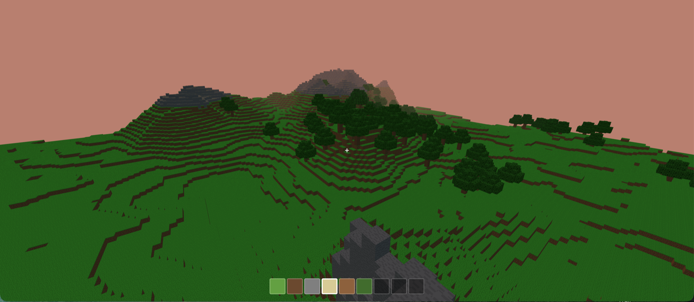

# Minecraft MVP

<!-- Lien démo — à activer après la Phase 3 (GitHub Pages) :
▶️ **[Jouer à la démo en ligne](https://elpfries.github.io/minecraft-mvp/)**
-->
<!-- Badge CI — à activer après la Phase 2 (GitHub Actions) :

-->

Un mini-Minecraft **jouable dans le navigateur**, construit avec **TypeScript**,
**three.js** et **Vite**. Mode créatif : on explore un monde à relief, on casse
et on pose des blocs, sous un cycle jour/nuit.



## Fonctionnalités

- 🌍 **Monde procédural** 256 × 256 × 64, généré par bruit déterministe (graine) :
  plaines, **collines arrondies** (herbe), **montagnes pointues** avec **pierre
  apparente**, et **forêts** groupées (zones denses + plaines sans arbres).
- 🌳 **Arbres** (chênes façon Minecraft) : tronc en bois, couronne de feuilles.
- 🧊 **Rendu** three.js : un mesh par section avec *face culling*, **textures**
  (atlas 16×16, filtre *nearest* pixel-art), re-meshing incrémental à chaque
  bloc modifié.
- 🚶 **Déplacement FPS** : marche, saut, gravité, collisions AABB, *pointer lock*
  (clavier **ZQSD**/WASD géré via les codes physiques → OK sur AZERTY).
- ⛏️ **Casser / poser** des blocs via raycast, avec surbrillance du bloc visé.
- 🎒 **Hotbar** (herbe, terre, pierre, sable, bois, feuille) au clavier ou à la molette.
- 🌗 **Cycle jour/nuit** (~3 min) : ciel, soleil et lumière ambiante animés.

## Commandes de jeu

| Action              | Touche / souris                    |
| ------------------- | ---------------------------------- |
| Capturer la souris  | **Clic** sur la fenêtre            |
| Se déplacer         | **Z Q S D** (AZERTY) / W A S D     |
| Sauter              | **Espace**                         |
| Regarder            | **Souris**                         |
| Casser un bloc      | **Clic gauche**                    |
| Poser un bloc       | **E** (ou clic droit)              |
| Choisir un bloc     | **1–9** ou **molette**             |
| Libérer la souris   | **Échap**                          |

## Prérequis

- [Node.js](https://nodejs.org/) ≥ 18
- npm (fourni avec Node)

## Installation & lancement

```bash
npm install
npm run dev      # http://localhost:5173
```

## Scripts

| Commande            | Description                                           |
| ------------------- | ----------------------------------------------------- |
| `npm run dev`       | Serveur de dev Vite (http://localhost:5173)           |
| `npm run build`     | Vérifie les types puis build de production             |
| `npm run preview`   | Sert le build de production en local                  |
| `npm run typecheck` | Vérifie les types sans émettre de fichiers            |

## Structure

```
minecraft-mvp/
├── index.html              # Page hôte (monte src/main.ts)
├── public/                 # Assets statiques servis tels quels
├── specs/                  # 📄 Spécifications détaillées (00 → 10)
├── src/
│   ├── main.ts             # Point d'entrée (monte le jeu)
│   ├── Game.ts             # Orchestration + boucle de jeu (pas fixe)
│   ├── core/               # constantes, maths, bruit, PRNG, horloge
│   ├── world/              # World, blocs, coordonnées, génération, arbres
│   ├── render/             # Renderer, mesher, sections, matériaux, environnement
│   ├── player/             # Player, caméra FPS, contrôleur, physique
│   ├── interaction/        # raycast voxel, casser/poser, surbrillance
│   ├── input/              # clavier / souris / pointer lock
│   ├── ui/                 # hotbar, réticule
│   └── time/               # cycle jour/nuit
├── tsconfig.json           # Config TypeScript (app)
├── tsconfig.node.json      # Config TypeScript (outillage / vite.config)
└── vite.config.ts          # Config Vite (alias @ -> src)
```

## Documentation

Le dossier [`specs/`](./specs/) contient la spécification complète du projet
(architecture, monde, rendu, physique, interaction, HUD, jour/nuit, arbres).
Voir [`specs/README.md`](./specs/README.md) pour l'index.

## Réglages

Les principaux paramètres (relief, forêts, physique, jour/nuit) sont regroupés
dans [`src/core/constants.ts`](./src/core/constants.ts) et documentés dans les specs.

## Auteurs

Projet développé **en famille**, avec une démarche *spec-first* assistée par IA
(Claude Code) :

- **Eric** ([elpfries](https://github.com/elpfries)) — conception, spécifications, développement
- **R.** — tests, idées, relecture
- **A.** — tests, idées, relecture

> 🔒 Par respect de la vie privée, les enfants apparaissent sous **initiales**
> (pas de prénoms complets, de noms de famille, d'âges ni de photos).

## Licence

Le **code** de ce projet est distribué sous licence **[MIT](./LICENSE)** : libre
de réutilisation, avec conservation de la mention de copyright.

Les **assets** (textures) suivent leur propre licence — voir ci-dessous.

## Crédits & licences des assets

Les textures des blocs proviennent de **ProgrammerArt** (par *deathcap* et
contributeurs), sous licence **[CC-BY-4.0](https://creativecommons.org/licenses/by/4.0/)** —
dépôt : <https://github.com/deathcap/ProgrammerArt>.

*Modifications apportées :* sélection d'un sous-ensemble de tuiles 16×16
(herbe, terre, pierre, sable, bois, feuilles) assemblées en un atlas au
chargement. Fichiers et licence complète dans
[`public/textures/blocks/`](./public/textures/blocks/).

## Dépannage

Si `npm install` échoue avec une erreur de permission sur `~/.npm/_cacache`
(cache appartenant à `root` après un ancien `sudo npm`) :

```bash
sudo chown -R $(whoami) ~/.npm
```
